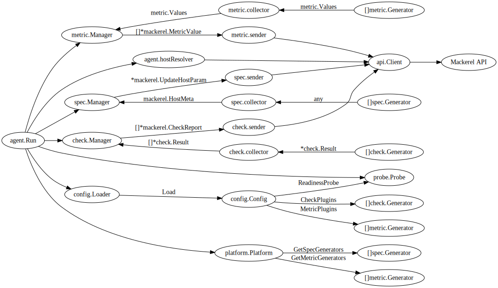

# Design document
## Code architecture
The following image represents the code architecture of this repository.

## Packages
### main package
The main package is implemented in cmd/mackerel-container-agent.

- `os.Exit` is allowed only in this package.

### agent package
The agent package implements the main logic of the agent.

- Load the config using `config.Loader`. If the polling duration is configured,
  restart the agent on config changes.
- Restart the agent on receiving `SIGHUP` signal.
- Create Mackerel API client.
- Create `platform.Platform`.
- Collect `[]metric.Generator`, `[]check.Generator` and `[]spec.Generator` from
  the platform and config. Create `metric.Manager`, `check.Manager` and
  `spec.Manager` from the generators.
- Check the platform status running, readiness probe.
- Create a new host or find the host from the id file or the custom identifier.
  When the host id is resolved, pass it to the managers by `SetHostID`.
- Start the loops of each managers by calling `Run`.
- Exit the agent on receiving `SIGINT`, `SIGTERM` or `SIGQUIT` signals.
- Retire the host on exit.

### metric package
The metric package implements the logic of collecting and posting metric values.

- `metric.Manager` has `metric.collector` and `metric.sender`. The manager
  periodically collects the metric values from the collector and post them with
  the sender.
- `metric.collector` has `[]metric.Generator`. The collector collects metric
  values from the generators.
- `metric.sender` has `api.Client` and `hostID`. Note that `hostID` is set
  lazily so the metric values are stored on memory until the host id is
  resolved.

### check package
The check package implements the logic of collecting and posting check reports.

- The package has almost the same architecture of the metric package.

### spec package
The spec package implements the logic of collecting and posting host spec.

- The package has almost the same architecture of the metric package.

### api package
The api package defines the interface of Mackerel API client and mock client.

- All the senders depend on the `api.Client` interface, not mackerel-client-go.
- Mock client is used in the tests and created in the style of functional
  options pattern.

### platform package
The platform package defines the `platform.Platform` interface, which has
methods to create the metric and spec generators.

- There are two platforms; `ecsPlatform` and `kubernetesPlatform`.

### probe package
The probe package defines the `probe.Probe` interface, which is used by the
readiness probe feature.

- There are three probes; `probeExec`, `probeHTTP` and `probeTCP`.

### config package
The config package defines `config.Config` and `config.Loader`.

### cmdutil package
The cmdutil package defines `cmdutil.RunCommand`, which is used by metric, check
plugins and exec probe.
